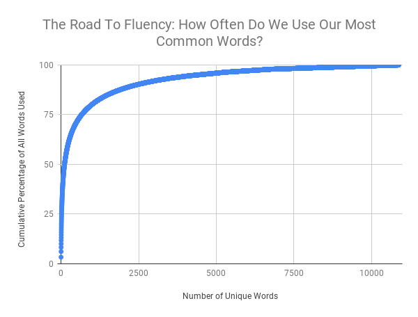

# Course Maker
A script to parse sentences in a language corpus, and sort them in an order ideal for language studies.

## The Idea

Most used 100 words in a language make up approximately 50% of words in a corpus (This of course varies from language to language. E.g. it is lover in agglutinative languages). If you sort the most used words and start learning words from this list (frequency sorted list `fsl`) you can effectively increase your hit rate in the corpus. 

I want to sort sentences in a similar manner. The first sentence of the proposed order shall ideally contain the first n words in the `fsl`. Any sentence can contain any number of words from previous sentences, and tries to incorporate any number of next m most used words.

The 'vocabulary expansion per words studied' curve  is ideally the same as the curve given above and it can theoretically (and practically) never exceed this curve. To achieve this, no `m`th sentence shall use the `n+1`th word in the sorted list if the first `m` sentences don't contain any of the first `n` words.

## Data analysis

I chose `A Tale of Two Cities`  as a corpora while conducting my experiments. I normalized the corpus and divided it into sentences. I extracted 7481 sentences, which contain 9940 unique words.  All words are counted and sorted according to their frequencies/counts.

The `preprocess_corpus.py`  script extracts sentences from a corpus and saves them in a CSV format in their original order. It also saves the words and their counts as a CSV file.  

>     -i: input text file containing the corpus
>     -o: output csv file for sentences
>     -s: (optional) the starting string for the corpus in the file (to skip through some initial parts)

`python3 preprocess_corpus.py -i data/corpus/twocities.corpus -o data/csv/twocities -ptc "[('mr.','mr'),('mrs.','mrs')]" -s 'the footsteps'`

## Sorting the sentences

I tried out many different approaches, out of which I found one to converge with the ideal learning curve. 

### The algorithm

1. Using `sort_sentences.py`, we make a copy of the sentences and the dictionary. 
2. For every sentence, we compute the following: Average frequency of unique words in the sentence, which are also in the dictionary. 

After we find the sentence with the maximum average return, we discard that sentence from our sentence list, and we discard every word used in the sentence from our dictionary. We then continue to the next step where we do it all over again with the current sentences and dictionary. 

>     -is:        input csv file containing sentences
>     -if:        input csv file containing frequencies
>     -o: 		output csv file for sorted sentences
>     -col:       name of the column containing sentences in the input csv file
>     -sc:        number of sentences to return, default (-1 for max)

`sort_sentences.py -is data/csv/twocities.csv -if data/csv/twocities_freqs.csv -o out_twocities -col sentence -sc 100`

(The current code is not optimized and really inefficient as of 2020/11/29) 

### The results

We have successfully found the best order of sentences to converge with the ideal vocabulary expansion curve.

## Application areas

I had this idea while thinking about automating the task of creating a language course. While this idea does not take into consideration the following factors:

* Stemming
* Grammar
* Topic-Attentive Ordering

It provides a good baseline for future work.

## Future work

The most immediate factor to consider as a future work for this project would be **stemming**. While this approach works better in English which has relatively low usage of affixes/infixes/suffixes, for a language like Turkish, Hungarian or Finnish, the word count process would perform poorly.

## More Word Statistics 

*src. : @thevenuehouse on reddit (on an Indonesian corpus)*

A few interesting learnings:

- The top word 'yang', meaning 'that' or 'which' makes up 3% of all usage.

- Top 10 most common = 18% of all usage

- Top 100 most common = 50% of all usage

- Getting from 0% to 50% understanding of vocabulary means learning just 100 words. Getting from 50% to 98% means learning 9900.

  ...

- This indicates the road from intermediate to fluent is much more difficult than novice to intermediate.
  ...
