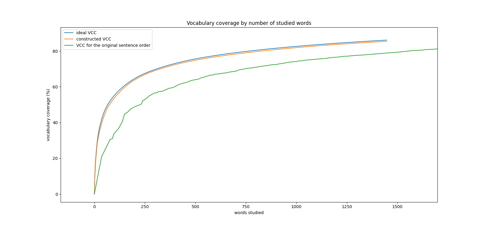

# Course Maker
A script to parse sentences in a language corpus, and sort them in an order ideal for language studies.

## The Idea

Most used 100 words in a language make up approximately 50% of words in a corpus (This of course varies from language to language. E.g. it is lover in agglutinative languages). If you sort the most used words and start learning words from this list (frequency sorted list `fsl`) you can effectively increase your hit rate in the corpus. 

I want to sort sentences in a similar manner. The first sentence of the proposed order shall ideally contain the first n words in the `fsl`. Any sentence can contain any number of words from previous sentences, and tries to incorporate any number of next m most used words.

The 'vocabulary expansion per words studied' curve  is ideally the same as the curve given above and it can theoretically (and practically) never exceed this curve. To achieve this, no `m`th sentence shall use the `n+1`th word in the sorted list if the first `m` sentences don't contain any of the first `n` words.

## Data analysis

I chose `A Tale of Two Cities`  as a corpora while conducting my experiments. I normalized the corpus and divided it into sentences. I extracted 7481 sentences, which contain 9940 unique words.  All words are counted and sorted according to their frequencies/counts.

The `preprocess_corpus.py`  script extracts sentences from a corpus and saves them in a CSV format in their original order. It also saves the words and their counts as a CSV file.  

>                     -i:  	input text file containing the corpus
>                     -o:  	output csv file for sentences
>                     -s:  	(optional) the starting string for the corpus in the file (to skip through some initial parts)
>                     -a:  	(optional) alphabet, default 'latin', supports 'cyrillic'.
>                     -stm:	(optional) apply stemming while processing tokens. Supports 'ru' (Russian).
>                     -ptc:	(optional) pre-tokenization replace. to replace certain substrings 
>                     > example: "[('mr.', 'mr'),('mrs.', 'mrs')]" to avoid sentence separation on the dots.
>                     

i.e.:
`python3 preprocess_corpus.py -i data/corpus/ru_books.corpus -o data/csv/ru_books -stm ru `

## Sorting the sentences

I tried out many different approaches, out of which I found one to converge with the ideal learning curve. 

### The algorithm

1. Using `sort_sentences.py`, we make a copy of the sentences and the dictionary. 
2. For every sentence, we compute the following: Average frequency of unique words in the sentence, which are also in the dictionary. 

After we find the sentence with the maximum average return, we discard that sentence from our sentence list, and we discard every word used in the sentence from our dictionary. We then continue to the next step where we do it all over again with the current sentences and dictionary. 

>                     -is: 	*(--input_sentences) input csv file containing sentences
>                     -if: 	*(--input_frequencies) input csv file containing frequencies
>                     -o:  	*(--out) output csv file for sorted sentences
>                     -col:	 (--sentence_column) name of the column containing sentences in the input csv file (default 'sentence')
>                     -sc: 	 (--sentence_count) number of sentences to return, default (-1 for max, 20 default)
>                     -csl:	 (--consider_n_sentences) number of considered sentences in the corpus
>                     -msl:	 (--min_sentence_length) minimum sentence length for consideration
>                     -d:  	 (--dictionary) dictionary file, if not used, translations won't be written
>                          	 expected cols: 'word', 'translation'
>                     -s:  	 (--stemming) stemming language, default none, available: ru
>                     
>                     *: required

i.e.:
`python3 sort_sentences.py -is data/csv/ru_books.csv -if data/csv/ru_books_freqs.csv -o out/ru_books -sc 1000 -s ru` 

Yields 100 best sentences to maximize vocabulary coverage with the minimum number of words learned.

### The results

We have successfully found the best order of sentences to converge with the ideal vocabulary expansion curve.

## Additional options

`CourseMaker` gives the user the opportunity to make use of

1. A stemming script/program to only take into account stems as tokens, to render the vocabulary acquisition process more more useful.

   Currently, stemming support is only available for Russian

2. a CSV dictionary to include meanings of the vocab points in given sentences.

## Application areas

I had this idea while thinking about automating the task of creating a language course. While this idea does not take into consideration the following factors:

* Grammar
* Topic-Attentive Ordering (Separation into units)

It provides a good baseline for future work.

## We could make a course out of this!

So we will do just that. For now, `coursemaker` courses give no grammar explanation, or give no translation for the target sentence. However, using our scripts' capabilities to the maximum we can get a somewhat decent course material.

Let's run `formatter.py` with the following command:

`python3 formatter.py -i out/ru_books.csv -l russian -f html`

Keep in mind that formatter takes these arguments:

>        -i:  	*(--input) input csv file containing sentences
>        -l:  	*(--language) name of the corpus's language
>        -o:  	 (--output) path for formatted output file
>        -f:  	 (--format) output format (default: 'md')
>             	  > available: 'md', 'html'
>             	  > future work: 'latex'
>        
>        *: required

We will get a page similar to the following, in a printable `html` file.

You can check out an example output from [this example russian material md](./courses/russian_course.md).

## Future work

Currently, my first priority will be **sentence translations**. Translations of whole sentences would be a nice addition to this project to provide a more complete learning experience. I'm planning to use the Google Translate workaround method from another project I made a year ago. 

